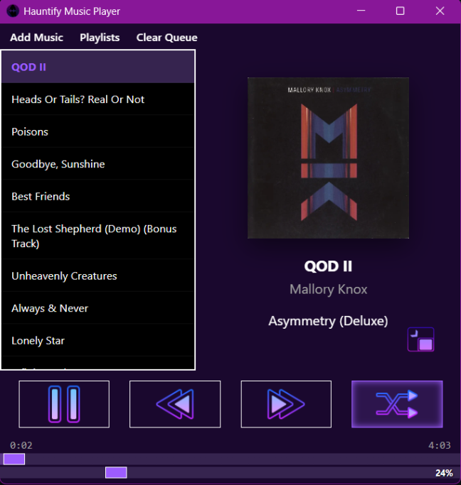
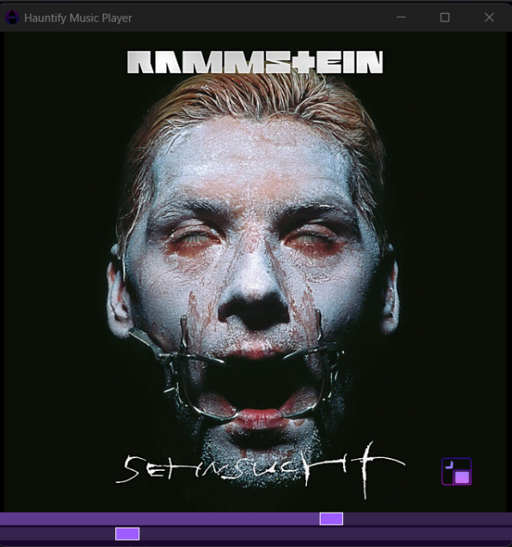
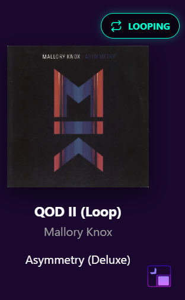

# Hauntify Music Player

This is a music player that I built myself!

Originally it started as a custom shuffle algorithm that I wrote because I wanted to see if I could make something that felt more random 
than YouTube, Spotify and Apple Music. 
I succeeded but quickly discorvered that there wasn't an easy way to insert my custom 
shuffle algorithm into any existing music players. So I decided to make my own. 
At first it was just for the sake of having a proof of concept. The whole point was to have a basic player, with basic functions (play, pause, skip and shuffle) purely to demonstrate the robustness of the shuffle algorithm.
But as I shared it around, it started to take a much more full form. I started adding features upon request and recommendation.
I had my brother help me add some flair. 
Just when I thought the player was complete and there was nothing left to do, I kept running into problems created by the constraints of 
having written the player in Python. So I decided to completely rewrite it using Rust. And here we are! :)

There are a few more things I have to translate from the Python version for it to be a fully-featured player but unfortunately I lost the ENTIRE CODEBASE for this version of the player... so I would have to start from scratch again >.>
I'll get around to it eventually.
When I finally do, the only features missing are the ability to set it as a default app for music files, windows media support (so you can see 
it on your lock screen and play pause from the task bar) and better metadata and file type support.

Until then, here is a detailed explanation of how to use every function!

# Hotkeys
- F2 - Volume Down (in increments of 5 percent)
- F3 - Volume Up (in increments of 5 percent)
- F4 - Mute (this is NOT a toggle, it just sets the volume to 0 percent)
- F6 - Previous track
- F7 - Play/Pause
- Shift + F7 - toggle looping the current track
- F8 - Next track
- F9 - Shuffle (this is not a toggle, pressing this will always shuffle or reshuffle!)
- Shift + F9 - *UN*shuffle

# The Buttons
Music can be added to the queue with the "Add Music" button (obviously). You can add individual files/multiple files using the 
"Add Track(s)" option, or a folder/multiple folders with the "Add Folder(s)" option
Note, when adding folders, Hauntify with follow the directory tree all the way down
and add tracks in the order it finds them. Adding discographies is super easy because of this :)
The Playlists menu is from creating playlists or adding playlists to the queue

# Other functions

The little icon in the bottom right of the album art puts the player into what I consider "MiniPlayer Mode" showing only the album art and the track progress and volume control. It's resizable and scales accordingly!

The shuffle button can be clicked or right-clicked (shuffle and unshufffle, respectively)

To loop a track without needing to use the hotkey, simply right-click the album art

The playlist creator is extremely convenient! It supports dragging and dropping individual files, clusters of files, individual folders, and clusters of folders. Or you can just use the regular old file browser by clicking "Add Files". Click an entry in the creator to "select it" and then you can remove anything you don't want. You have to click any file you have already clicked to unselect it.
Once you have your playlist fully assembled just click "Save .graveyard" and pick the name and where you want it saved in the file picker.

I hope you enjoy my player as much as I do!

# _UPDATE_
Well, this is embarassing. Apparently the scrobble and loop functions are both just completely broken. Looks like I gotta start from scratch like I was saying before to even have a FULLY WORKING version. SMH.
Let this be a lesson to everyone who thinks Vibe Coding is viable. It isn't. I vibe coded this version because I don't KNOW Rust and did not have the patience to learn it. Now I'm just going to learn it so I can build it fully on my own like I did the python version. Sorry everyone, stay tuned for updates 🙏
